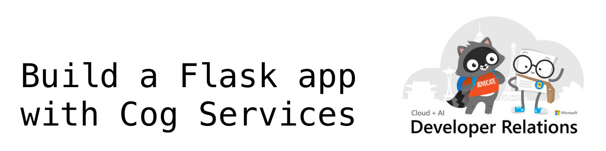

---

## Welcome to camp!

We're glad that you could join us for today's workshop. In the next hour, we're going to build a Flask-based web app that uses Azure Cognitive Services to translate text, analyze sentiment, and synthesis translated text into speech.

Our focus is on the Python code and Flask routes that enable our application. We won't spend much time on the Javascript that controls the front-end, but provide all the files for you to inspect after this session (if you're a master in the art of jQuery - don't be shy, submit a PR).

If you get stuck during the workshop on May 28, 2019, please use one of our [support channels](support-channels) for help.

After this session, if you have any questions or want to say hi, just drop a line: [erhopf@microsoft.com](mailto:erhopf@microsoft.com)

## What is Flask?

Flask is a microframework for creating web applications. This means flask provides you with tools, libraries and technologies that allow you to build a web application. This web application can be some web pages, a blog, a wiki or go as big as a web-based calendar application or a commercial website.

I'm going to stop here. For those of you who want to deep dive after this workshop here are a few helpful links:

* [Flask documentation](http://flask.pocoo.org/)
* [Flask for Dummies - A Beginner's Guid to Flask](https://codeburst.io/flask-for-dummies-a-beginners-guide-to-flask-part-uno-53aec6afc5b1)

## Let's get started

Now that you have an idea of what we're going to build, let's get started.

[View prerequisites](prerequisites){: .btn .btn-green }
